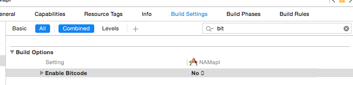

Xcode7(beta)での-fembed-bitcodオプションエラーの回避方法
---
Xcode7(beta)から-fembed-bitcodオプション（watchOS対応アプリをストアに提出する場合に必要な設定らしい）のデフォルトがYESになったことで実機インストールする際にエラーが発生するようになった。  
watchOSに対応しないなら、プロジェクト設定 > Build Settings > BUild Options > Enabled Bitcodeの値をNOにする。

