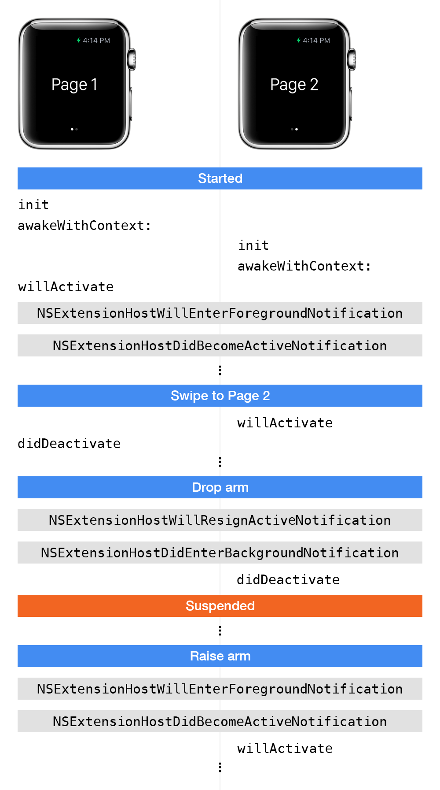

watchOSのライフサイクルについて
---
* init  
  ↓
* awakeWithContext：iOSにおける viewDidLoad に近いイメージ  
  ↓
* willActivate：iOSにおけるviewWillAppear: に近いイメージ  
  ↓
* didDeactivate：iOSにおけるviewDidDisappear: に近いイメージ

画像は以下より引用：(http://blog.mikeswanson.com/post/118262770484/watchkit-controller-life-cycle)