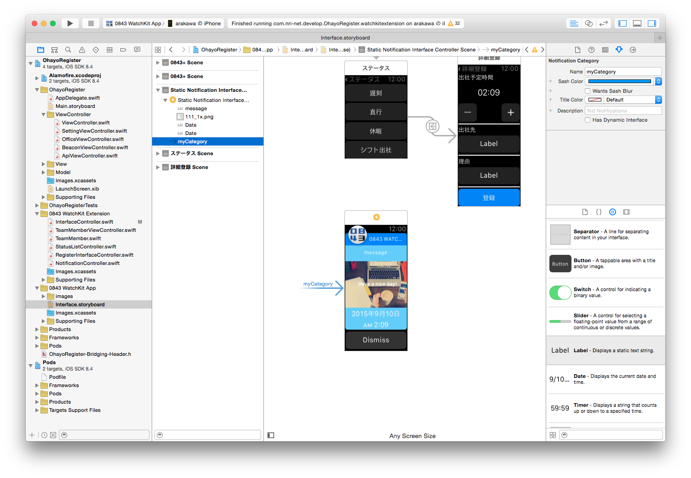

カスタムNotification画面の指定方法
---
* storyboardのNotification Interface ControllerのNotification CategoryのNameにカテゴリ名を設定する

* iPhone側のnotificationオブジェクトのcategoryプロパティに同じカテゴリ名を設定する

      let notification = UILocalNotification()
      notification.category = "myCategory"
